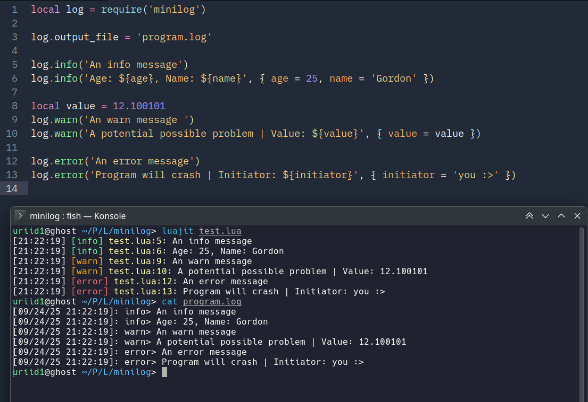

# minilog.lua

Небольшой логгер с обработкой строк через fstring, отправкой ошибок в stderr и простой конфигурацией.



# Установка

```lua
local log = require('minilog')
```

# Использование

  - `log.disable_stdout` (boolean) - При значении `true` вывода в *stdout* не будет.
  - `log.disable_stderr` (boolean) - При значении `true` вывода в *stderr* не будет.
  - `log.output_file` (string) - Путь для записи лога в файл. `nil` для отключения записей логов.
  - `log.force_flush` (boolean) - Принудительно сбрасывает строковый буфер после каждого вывода в консоль.
  - `log.date_format` (string) - Формат даты лога, параметры берутся из `os.date`.
  - `log.debug` (boolean) - Включает или отключает использование `debug.getinfo`.
